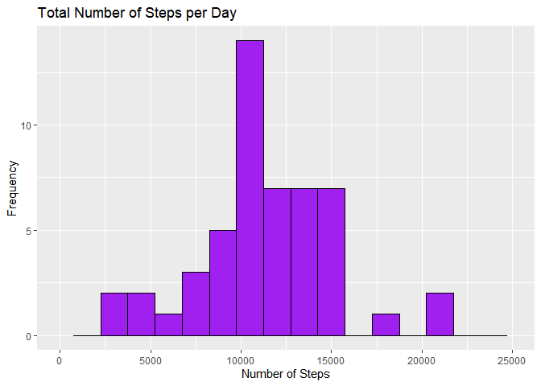
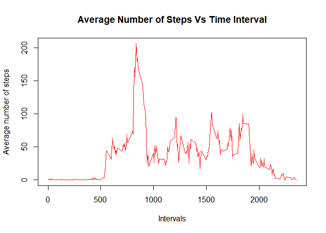
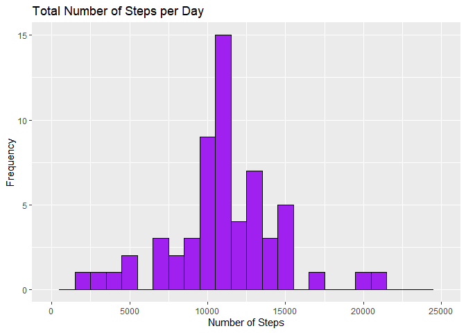
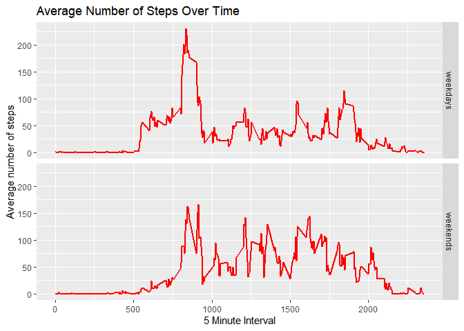

```r
knitr::opts_chunk$set(echo = TRUE)
```
# Overview

This is the first project for Reproducible Research course offered by the Johns Hopkins University on Coursera. The Course is part of the ten course specialization on data science offered by the university.

For this assignment, data from a personal activity monitoring device, which collects data at 5 minute intervals through out the day is used. The data is collected over two months(October and November) in 2012, from an anonymous individual, and include the number of steps taken in 5 minute intervals each day.

# Data

Tha data is downloaded from [Git Hub Repository](https://d396qusza40orc.cloudfront.net/repdata%2Fdata%2Factivity.zip) and  is stored in a comma-separated-value (CSV) file. There are a total of 17,568 observations in this dataset.

The variables included in this dataset are:

-steps: Number of steps taking in a 5-minute interval (missing values are coded as \color{red}{\verb|NA|}NA)
-date: The date on which the measurement was taken in YYYY-MM-DD format
-interval: Identifier for the 5-minute interval in which measurement was taken

## Downloading and Processing data

To set the working directory

```r
setwd("C:/Users/dimut/desktop/Data Science/Reproducible Research")
```

Downloading and loading data onto R


```r
library(RCurl)
filePath <- getwd()
download.file("https://d396qusza40orc.cloudfront.net/repdata%2Fdata%2Factivity.zip",file.path(filePath,"./repdata%2Fdata%2Factivity.zip"))
unzip("repdata%2Fdata%2Factivity.zip")
```

To read the file


```r
activity <- read.csv("activity.csv")
```


```r
head(activity)
```

```
##   steps       date interval
## 1    NA 2012-10-01        0
## 2    NA 2012-10-01        5
## 3    NA 2012-10-01       10
## 4    NA 2012-10-01       15
## 5    NA 2012-10-01       20
## 6    NA 2012-10-01       25
```

```r
str(activity)
```

```
## 'data.frame':	17568 obs. of  3 variables:
##  $ steps   : int  NA NA NA NA NA NA NA NA NA NA ...
##  $ date    : chr  "2012-10-01" "2012-10-01" "2012-10-01" "2012-10-01" ...
##  $ interval: int  0 5 10 15 20 25 30 35 40 45 ...
```


```r
summary(activity)
```

```
##      steps            date              interval     
##  Min.   :  0.00   Length:17568       Min.   :   0.0  
##  1st Qu.:  0.00   Class :character   1st Qu.: 588.8  
##  Median :  0.00   Mode  :character   Median :1177.5  
##  Mean   : 37.38                      Mean   :1177.5  
##  3rd Qu.: 12.00                      3rd Qu.:1766.2  
##  Max.   :806.00                      Max.   :2355.0  
##  NA's   :2304
```

To adjust date format


```r
activity$date <- as.Date(activity$date)
```


## What is mean total number of steps taken per day?

Total number of steps taken per day:

```r
library(reshape2)
```

```
## Warning: package 'reshape2' was built under R version 4.0.2
```

```r
library(dplyr)
```

```
## 
## Attaching package: 'dplyr'
```

```
## The following objects are masked from 'package:stats':
## 
##     filter, lag
```

```
## The following objects are masked from 'package:base':
## 
##     intersect, setdiff, setequal, union
```

```r
total_steps <- tapply(activity$steps, activity$date, sum, na.rm = TRUE)
head(total_steps)
```

```
## 2012-10-01 2012-10-02 2012-10-03 2012-10-04 2012-10-05 2012-10-06 
##          0        126      11352      12116      13294      15420
```

Histogram of the total number of steps taken each day


```r
library(ggplot2)

TotSteps <- data.frame(total_steps)
g <- ggplot(TotSteps,aes(x =total_steps) ) +
        geom_histogram( binwidth = 1500 ,color="black" , fill = "purple" ) 
g <- g + labs( title = "Total Number of Steps per Day", x= "Number of Steps", y= "Frequency") + xlim(c(0,25000))
g
```

```
## Warning: Removed 2 rows containing missing values (geom_bar).
```

<!-- -->
Mean and median of total number of steps per day


```r
mean_steps <- mean(total_steps)
mean_steps
```

```
## [1] 9354.23
```


```r
median_steps <- median(total_steps)
median_steps
```

```
## [1] 10395
```


The mean number of steps is 9354 and the meadian number of steps is 10395.

## What is the average daily activity pattern?

Make a time series plot (i.e. \color{red}{\verb|type = "l"|}type = "l") of the 5-minute interval(x-axis) and the average number of steps taken, averaged across all days (y-axis)


```r
avg_steps <- tapply(activity$steps, activity$interval, mean, na.rm = TRUE)
head(avg_steps)
```

```
##         0         5        10        15        20        25 
## 1.7169811 0.3396226 0.1320755 0.1509434 0.0754717 2.0943396
```


```r
plot(names(avg_steps), avg_steps,  type="l", col = "red",main ="Average Number of Steps Vs Time Interval", xlab="Intervals", ylab="Average number of steps")
```

<!-- -->

Which 5-minute interval, on average across all the days in the dataset, contains the maximum number of steps?


```r
max_avg <- max(avg_steps)
max_avg
```

```
## [1] 206.1698
```


```r
max_interval <- (names(avg_steps)[which(avg_steps==max(avg_steps))])
max_interval
```

```
## [1] "835"
```

The maximum average number of steps(206) is contained in the 835th interval. 

## Imputing missing values

Total number of NA


```r
tot_NA <- sum(is.na(activity$steps))
tot_NA
```

```
## [1] 2304
```

The total number of missing values in the data set is 2304.

To fill in the missing values


```r
 imp_activity <- activity
 imp_activity$steps[which(is.na(activity$steps))] <- avg_steps[as.character(imp_activity$interval[which(is.na(activity$steps))])]
```

Total number of steps taken each day


```r
 steps_day <- tapply(imp_activity$steps, imp_activity$date, sum, na.rm = TRUE)
 head(steps_day)
```

```
## 2012-10-01 2012-10-02 2012-10-03 2012-10-04 2012-10-05 2012-10-06 
##   10766.19     126.00   11352.00   12116.00   13294.00   15420.00
```
 
 

```r
 StepsPerDay <- data.frame(steps_day)
 g <- ggplot(StepsPerDay,aes(x = steps_day) ) +
         geom_histogram( binwidth = 1000 ,color="black" , fill = "purple" ) 
 g <- g + labs( title = "Total Number of Steps per Day", x= "Number of Steps", y= "Frequency") + xlim(c(0,25000))
 g
```

```
## Warning: Removed 2 rows containing missing values (geom_bar).
```

<!-- -->
 
Mean total number of steps


```r
Mean_steps_day <- mean(steps_day)
Mean_steps_day
```

```
## [1] 10766.19
```
 
Median number of steps


```r
 Median_steps_day <- median(steps_day)
 Median_steps_day
```

```
## [1] 10766.19
```

Both the mean and the median total number of steps is 10766. After imputing for missing values, both the mean and median number of steps have increased per day, compared to when the missing values were not accounted for(first part of the assignment).
 
## Are there differences in activity patterns between weekdays and weekends?
 
Create a new factor variable in the dataset with two levels - "weekday" and "weekend" indicating whether a given date is a weekday or weekend day.


```r
 imp_activity$daytype <- ifelse(as.POSIXlt(imp_activity$date)$wday %in% c(0,6), "weekends","weekdays")
```
5-minute interval


```r
 Fmin_int <- aggregate(steps ~ interval + daytype, data=imp_activity, mean)
```


```r
 g <- ggplot(Fmin_int, aes(x= interval, y= steps)) + geom_line(colour = "red", size =1) + facet_grid(daytype ~ .)  
 g <- g + xlab("5 Minute Interval") + ylab("Average number of steps")
 g <- g + labs( title = "Average Number of Steps Over Time")
 g
```

<!-- -->
 

